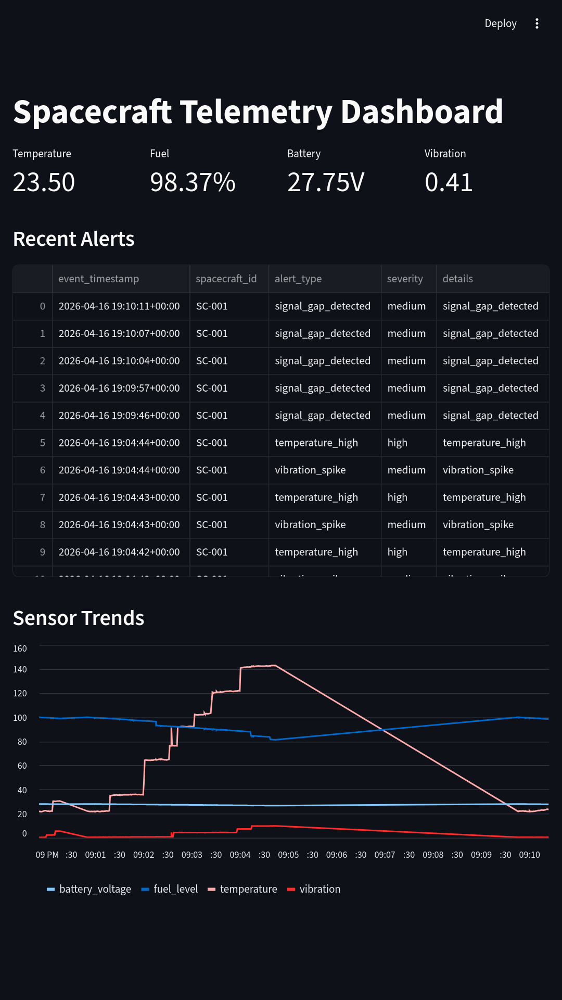

# Spacecraft Telemetry Pipeline (Project 1)

Tiny mission-control style data pipeline:

`Python generator -> Kafka -> Python consumer/validator -> Postgres -> Streamlit dashboard`

## What this MVP proves

- Continuous telemetry ingestion (1 event/sec)
- Streaming with producer/consumer pattern
- Data quality checks and cleaning
- Rule-based anomaly detection
- Raw vs cleaned storage model
- Basic time-series visibility in dashboard

## Tech Stack

- Python (generation + processing)
- Kafka (stream transport)
- Postgres (storage)
- Spark (processing practice job)
- Streamlit (dashboard)

## Project Layout

- `src/generator.py`: fake telemetry producer
- `src/consumer.py`: stream consumer + validation + anomaly checks
- `src/processing.py`: cleaning, validation, and alert rules
- `src/db.py`: Postgres writes for raw, cleaned, alerts
- `src/dashboard.py`: monitoring dashboard
- `src/spark_job.py`: simple Spark window aggregation practice
- `sql/init.sql`: DB schema
- `sample_data/`: sample cleaned telemetry for Spark/local testing
- `architecture.mmd`: architecture diagram source (Mermaid)

## Data Model

Telemetry fields:

- `timestamp`
- `spacecraft_id`
- `temperature`
- `pressure`
- `fuel_level`
- `battery_voltage`
- `vibration`
- `oxygen_level`

Generator realism:

- gradual drift
- occasional spikes
- missing values
- delayed timestamps

## Alert Rules (MVP)

- `temperature_high`: `temperature > 65`
- `fuel_drop_fast`: drop > 1.0 between consecutive records
- `vibration_spike`: `vibration > 3.0`
- `battery_drop_fast`: drop > 0.2 between consecutive records
- `signal_gap_detected`: timestamp gap > 6 seconds

## Setup

```bash
make setup       # create venv and install dependencies
make env         # copy .env.example to .env
make up          # start Kafka + Postgres via Docker
```

## Running

```bash
make generator   # start telemetry producer
make consumer    # start stream consumer + validator (new terminal)
make dashboard   # launch Streamlit dashboard (new terminal)
make spark       # run optional Spark aggregation job
```

## Other

```bash
make logs        # tail Docker service logs
make down        # stop Docker services
make clean       # stop Docker + remove volumes + clear __pycache__
```

### Manual setup (without Make)

1) Create virtual environment and install dependencies:

```bash
python -m venv .venv
source .venv/bin/activate
pip install -r requirements.txt
```

2) Start Kafka + Postgres:

```bash
docker compose up -d
```

3) Create env file:

```bash
cp .env.example .env
```

4) Run producer:

```bash
python src/generator.py
```

5) Run consumer (new terminal):

```bash
python src/consumer.py
```

6) Run dashboard (new terminal):

```bash
streamlit run src/dashboard.py
```

7) Optional Spark practice:

```bash
python src/spark_job.py
```

## Screenshots



## Architecture



## Notes for Portfolio Polish

- Add real screenshots after first successful run.
- Expand anomaly logic with moving average and z-score in next iteration.
